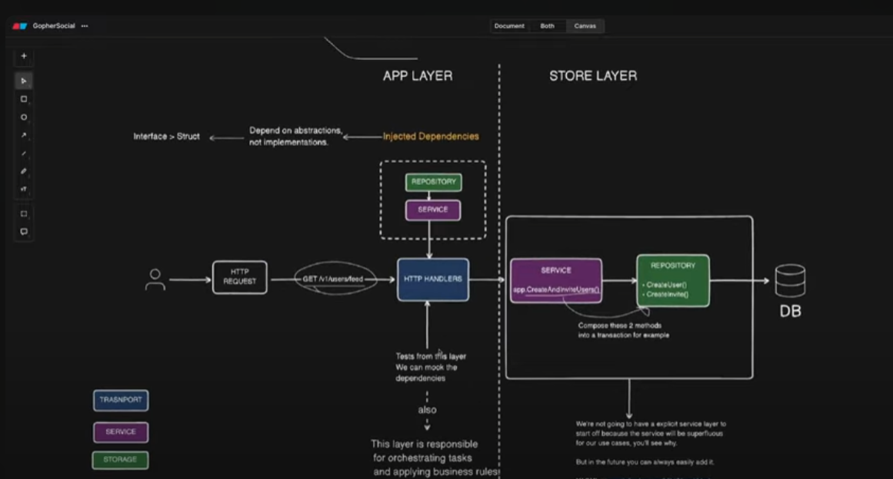

--> go mod init github.com/Wanjie-Ryan/Social-Prod --> Standard go intialization, Go will expect the project to be hosted at the Github URL if it were to be published
--> This way, Go can fetch dependencies from Github directly...
--> bin folder will contain the compiled Go code.
--> cmd folder will have the executables or entry point for the app CMD ---> api (any server related code will be here, http, middleware, etc)
--> internal will have the internal packages not to be exported
--> docs will contain swagger related code
--> scripts

**\*** PRINCIPLES \*\*\*

1. Separation of concerns
   -- Each level in your program should be separate by a clear barrier.
2. Dependency Inversion Principle
   -- Inject dependencies in your layers, you don't directly call them.
3. Adapatablitity to change
   -- Organize code in a modular and flexible way, so as it can be easy to introduce new features.
4. Business value
   -- Focus on delivering value to your users.

\***\* LAYERS \*\***

1. Transport Layer
   -- Way data is transmitted to the users --> HTTP
2. Service Layer
   -- B/S logic
3. Storage
   -- Abstracts communication btn the layers above, and the DB

**\*** POINTERS \*\*\*\*
Pointer --> Variable that stores the memory address of another variable.
-- Instead of holding a direct value like an int or string, a pointer holds the location where that value is.

\***\* WHY USE POINTERS \*\***

1. Efficiency
   -- When you pass large structs or data to functions, passing a pointer means you only pass the memory address, not a copy of the entire data. This saves memory and CPU time.

2. Mutability
   -- Passing pointers to functions modify the original data.

& (address of) --> Give me the address of the variable in memory.
-- it returns a pointer to the variable
x :=10
p := &x --> p is a pointer to x, holds x memory address
fm.Println(x) --> 10
fm.Println(p) --> something like 0xcfgh5748b0 - memory address of x

- (dereference) --> Go to the address stored in this pointer and get the value there.
  -- it accesses or changes the value that the pointer points to.
  x := 10
  p :=&x --> p points to x
  fmt.Println(*p) --> 10 - dereference p to get x's value
  *p = 20 // change the value at the address p points to
  fmt.Println(x) --> 20 - x was updated via the pointer.

Go-Chi
Lightweight, Idiomatic HTTP router and middleware stack for Go, like Express in node.
--> Quickly define routes, mount sub-routers, and apply middlewares

Air -- air-verse
hot reload tool in go

go install github.com/air-verse/air@latest
air init

direnv is a little program that hooks into your shell and automatically loads or unloads environment variables when you cd into (or out of) a project director
create a .envrc file
